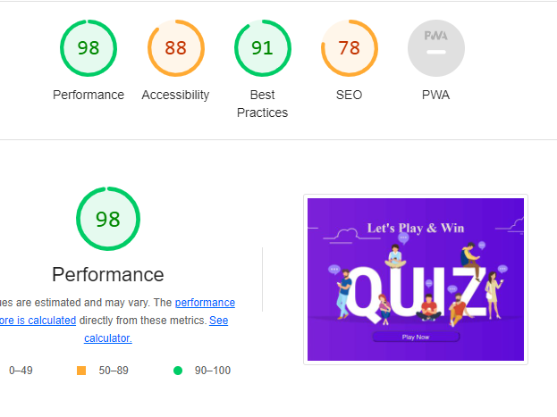
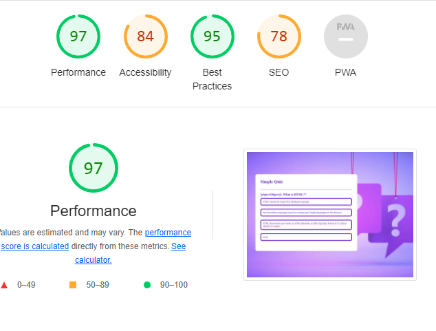

# Online Quiz

 Ice-Cream Shop is a app that helps student to take exam and try many times to get good results.
User of this website will be able to enhance thire knowledge about specific topic.

## Features 

- __Home page__

  - this page help user to start quiz by clikc button to go quiz page. 

- __Shows Score__

  - The page shows the final score of quiz
  

## Testing

## Bugs

### solved bugs
- I my gitpod did not allow me to push commit i find it to set permmistion.
- fixed the problem.

}
### Validator Testing 

- future plan to test the project.
  

### Unfixed Bugs

will fix the paly again button to resatrt the game button.

## Deployment
 

- The site was deployed to GitHub pages. The steps to deploy are as follows: 
  - In the GitHub repository, navigate to the Settings tab 
  - From the source section drop-down menu, select the Master Branch
  - Once the master branch has been selected, the page will be automatically refreshed with a detailed ribbon display to indicate the successful deployment. 

The live link can be found here - https://limazurmati.github.io/online-_quiz/

## Credits 
 youtub and w3school.

### Content 

- by help of w3school and love-running
- The icons in the footer were taken from [Font Awesome](https://fontawesome.com/)

### Media

- The photos used on the home and sign up page are from This Open Source site
- The images used for the flavors page were taken from this other open source site